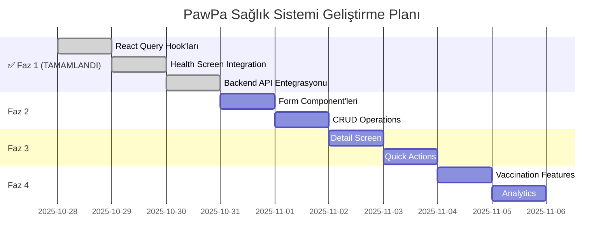

# 🏥 PawPa Sağlık Takip Sistemi Roadmap

**Tarih**: 28 Ekim 2025
**Sürüm**: v0.3.0 - Health Tracking Phase
**Durum**: 🟢 Faz 1 Tamamlandı

---

## 📊 Genel Bakış

PawPa pet care uygulamasının sağlık takip sistemi, evcil hayvanların tüm sağlık kayıtlarını yönetmek için kapsamlı bir çözüm sunacak. Mevcut altyapı tamamlandığı için frontend implementasyonuna odaklanacağız.

### 🎯 Ana Hedefler
- **Kapsamlı sağlık kaydı yönetimi** (CRUD işlemleri)
- **Aşı takibi ve hatırlatıcı sistemi**
- **Veteriner randevu yönetimi**
- **Sağlık analitiği ve raporlama**
- **Çok dilli destek** (Türkçe/İngilizce)

---

## 📈 Mevcut Durum

### ✅ Tamamlanan Altyapı
| Kategori | Durum | Detaylar |
|---------|-------|----------|
| **Backend API** | ✅ 100% | 6 endpoint tamamen hazır (+ /api/pets/:id/health-records) |
| **Service Layer** | ✅ 100% | HealthRecord service tamamlandı |
| **Veritabanı** | ✅ 100% | SQLite şeması hazır |
| **TypeScript Types** | ✅ 100% | Tüm tipler tanımlandı |
| **React Query Hooks** | ✅ 100% | 6 hook tamamlandı |
| **Dinamik Health Screen** | ✅ 100% | Pet seçme, filtreleme, pull-to-refresh |
| **Loading/Error States** | ✅ 100% | UI component'leri hazır |
| **Formlar** | ❌ 0% | UI formları yok (Faz 2'de) |

### 🔧 Mevcut Teknik Altyapı
- **6 API Endpoint**: CRUD operations + specialized queries (+ /api/pets/:id/health-records)
- **HealthRecord Service**: Complete HTTP client integration
- **React Query Hooks**: useHealthRecords, useVaccinations, useUpcomingVaccinations, useCreateHealthRecord, useUpdateHealthRecord, useDeleteHealthRecord
- **Database Schema**: health_records table with proper relations
- **UI Framework**: React Native Paper with rainbow pastel theme
- **Navigation**: Bottom tabs with health tab
- **Dynamic Filters**: Pet selection and health record type filtering
- **Real-time Updates**: Pull-to-refresh with cache invalidation
- **Error Handling**: Global error boundaries and user feedback

---

## 🚀 4 Fazlı Implementasyon Planı

### **✅ Faz 1: React Query Hook'ları ve Veri Entegrasyonu**
**Süre**: 1 gün
**Öncelik**: 🔴 Yüksek
**Tamamlanma**: 28 Ekim 2025

**Hedefler:**
- Health verilerini UI'a bağlamak
- Loading ve error state'leri eklemek
- Cache ve optimizasyon sağlamak

**✅ Tamamlanan Çıktılar:**
- ✅ React Query hook'ları (6 adet)
- ✅ Dinamik health screen
- ✅ Pull-to-refresh özelliği
- ✅ Error handling UI
- ✅ Pet seçme ve filtreleme
- ✅ Rainbow pastel tema entegrasyonu
- ✅ Backend endpoint entegrasyonu
- ✅ TypeScript tip güvenliği

### **Faz 2: Sağlık Kayıtları Formları**
**Süre**: 1 gün
**Öncelik**: 🔴 Yüksek

**Hedefler:**
- Complete form validation
- Tüm sağlık tiplerini desteklemek
- Modal/drawer navigation

**Çıktılar:**
- ✅ HealthRecordForm component
- ✅ Form validasyonu
- ✅ Modal navigation
- ✅ CRUD operations

### **Faz 3: Sağlık Kaydı Detayları ve Yönetimi**
**Süre**: 0.5 gün
**Öncelik**: 🟡 Orta

**Hedefler:**
- Detay görüntüleme ve yönetim
- Quick action improvements
- Better UX flows

**Çıktılar:**
- ✅ Detail screen
- ✅ Edit/Delete operations
- ✅ Quick actions

### **Faz 4: Gelişmiş Sağlık Özellikleri**
**Süre**: 1 gün
**Öncelik**: 🟢 Düşük

**Hedefler:**
- Vaccination tracking
- Health analytics
- Advanced features

**Çıktılar:**
- ✅ Vaccination dashboard
- ✅ Health analytics
- ✅ Advanced reports

---

## 📱 Kullanıcı Senaryoları

### 🐕 Pet Sahibi için Akışlar
1. **Yeni Sağlık Kaydı Ekleme**
   - Ana sayfa → "Sağlık Kaydı" → Form doldur → Kaydet
   - Pet detay → "Sağlık" → Yeni kayıt ekle

2. **Aşı Takibi**
   - Sağlık sayfası → "Aşılar" filtre → Yaklaşan aşıları gör
   - Hatırlatıcı al → Randevu planla

3. **Acil Durum Kaydı**
   - Hızlı ekleme → Veteriner kliniği → Notlar ekle
   - Fotoğraf ekle → Takip et

---

## 🎨 UI/UX Vizyonu

### Tasarım Prensipleri
- **Rainbow Pastel Theme**: Mevcut tema korunacak
- **Card-Based Layout**: Sağlık kayıtları kartlar halinde
- **Quick Actions**: Hızlı ekleme butonları
- **Empty States**: Boş durumlar için sevimli görseller
- **Loading States**: Smooth animasyonlar

### Ana Ekranlar
1. **Health Tab**: Tüm kayıtlar, filtreleme, arama
2. **Health Form**: Modal form, validasyonlu
3. **Health Detail**: Detaylı bilgi, düzenleme
4. **Vaccination Dashboard**: Aşı takvimi, hatırlatıcılar

---

## ⏱️ Zaman Çizelgesi

**Toplam Tahmini Süre**: 5-6 gün
**Faz 1 Tamamlanma**: 28 Ekim 2025
**Hedef Bitiş**: 3 Kasım 2025

---

## 🔗 İlişkili Dokümanlar

- **[Detaylı Implementasyon Planı](./health-implementation.md)** - Teknik adımlar ve kod örnekleri
- **[Proje Roadmap](./roadmap-current.md)** - Genel proje durumu
- **[UI/UX Planı](./ui.md)** - Tasarım sistemi ve component'ler

---

## 📝 Notlar

### Riskler ve Çözümler
- **Backend Integration**: ✅ Çözüldü - API hazır
- **Form Validation**: 🟡 Orta risk - React Hook Form kullanılacak
- **Performance**: ✅ Düşük risk - React Query optimize

### Başarı Metrikleri
- **Functional CRUD**: All operations working
- **Performance**: <2s load time for health records
- **UX Score**: Smooth interactions, no jank
- **Coverage**: Health record types fully supported

---

**Bu roadmap, PawPa uygulamasının sağlık takip sistemini kapsamlı bir şekilde implement etmek için tasarlanmıştır. Mevcut güçlü altyapı sayesinde frontend geliştirmeye odaklanabileceğiz.**