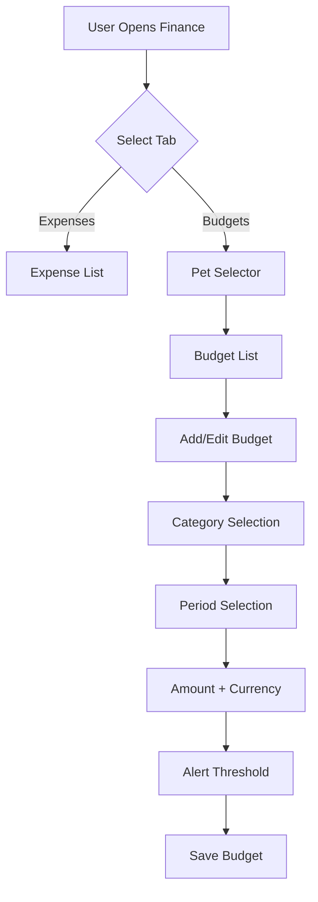
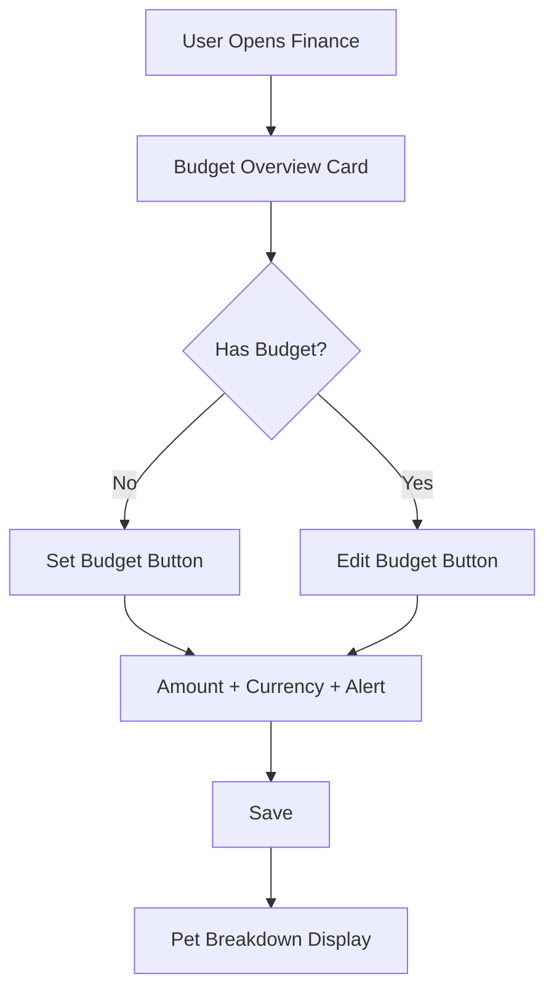

# Budget Simplification Master Plan

## 🎯 Vision

**"From Complex to Simple"** - Karmaşık budget sistemini basit, etkili ve kullanıcı dostu bir hale getirmek.

### 🏗️ Key Architectural Decision: User-Level Budget

**Important**: This master plan has been updated to align with the backend roadmap's **user-level budget** approach instead of the initially planned pet-level budget approach.

**Why User-Level Budget?**

- **Simplicity**: One budget per user instead of one per pet
- **Multi-pet Households**: Easier management for users with multiple pets
- **Data Aggregation**: All pet expenses automatically roll up to single budget
- **Reduced Complexity**: Fewer database records and simpler API calls
- **Better UX**: 2-step setup instead of 3-step setup

**Pet Breakdown Feature**: While using user-level budgets, we maintain visibility into individual pet spending through detailed breakdowns in the budget status API.

### 📊 Before & After Karşılaştırması

| Aspect              | Before (Complex)                      | After (Simple)                |
| ------------------- | ------------------------------------- | ----------------------------- |
| **Budget Types**    | Category + Overall (multiple per pet) | Single Overall (one per user) |
| **Periods**         | Monthly + Yearly                      | Monthly Only                  |
| **Setup Steps**     | 6 steps                               | 2 steps                       |
| **UI Components**   | 4 complex components                  | 2 simple components           |
| **Database Tables** | `budget_limits` (complex)             | `user_budgets` (simple)       |
| **API Endpoints**   | 8 endpoints                           | 4 endpoints                   |

## 🔄 High-Level Architecture

### Mevcut Akış (Complex)



### Yeni Akış (Simple)



## 📋 Implementation Timeline

### Week 1-2: Backend Foundation

- [x] Backend roadmap oluştur
- [ ] Database migration hazırla
- [ ] Yeni API endpoint'lerini geliştir
- [ ] Service layer'ı basitleştir
- [ ] Backend test'lerini yaz

### Week 3-4: Frontend Components

- [x] Frontend roadmap oluştur
- [ ] Yeni component'leri geliştir
- [ ] Type definitions'ı güncelle
- [ ] Hook'ları yeniden yaz
- [ ] Component test'leri oluştur

### Week 5-6: Integration & Testing

- [ ] Backend-Frontend entegrasyonu
- [ ] End-to-end test'ler
- [ ] User acceptance testing
- [ ] Performance optimization
- [ ] Documentation güncelleme

### Week 7: Deployment

- [ ] Backend deployment (migration)
- [ ] Frontend deployment
- [ ] Monitor ve fix
- [ ] User communication

## 🏗️ Technical Architecture

### Backend Architecture

```
┌─────────────────┐    ┌─────────────────┐    ┌─────────────────┐
│   Frontend      │    │   API Gateway   │    │   Database      │
│                 │    │                 │    │                 │
│ UserBudgetCard  │───▶│ UserBudgetRoutes│───▶│  user_budgets   │
│ UserBudgetForm  │    │                 │    │                 │
│ SimpleOverview  │    │ UserBudgetCtrl  │    │   expenses      │
│                 │    │                 │    │   pets          │
└─────────────────┘    └─────────────────┘    └─────────────────┘
```

### Frontend Architecture

```
┌─────────────────┐    ┌─────────────────┐    ┌─────────────────┐
│   UI Layer      │    │   Business      │    │   Data Layer    │
│                 │    │   Logic         │    │                 │
│ UserBudgetCard  │    │ useUserBudget   │    │ UserBudgetService│
│ UserBudgetForm  │    │ useSetUserBudget│    │                 │
│ SimpleOverview  │    │ useBudgetStatus │    │ API Client      │
│                 │    │                 │    │                 │
└─────────────────┘    └─────────────────┘    └─────────────────┘
```

## 📁 File Structure Changes

### Backend Changes

```
pawpa-backend/
├── src/
│   ├── models/
│   │   └── schema.ts (+ user_budgets table)
│   ├── services/
│   │   ├── userBudgetService.ts (yeni)
│   │   └── budgetService.ts (kaldır)
│   ├── controllers/
│   │   ├── userBudgetController.ts (yeni)
│   │   └── budgetController.ts (kaldır)
│   ├── routes/
│   │   ├── userBudgetRoutes.ts (yeni)
│   │   └── budgetRoutes.ts (kaldır)
│   └── migrations/
│       └── 001_simplify_budgets.sql (yeni)
└── docs/
    └── budget-simplification-roadmap.md
```

### Frontend Changes

```
pawpa/
├── components/
│   ├── UserBudgetCard.tsx (yeni)
│   ├── UserBudgetForm.tsx (yeni)
│   ├── UserBudgetFormModal.tsx (yeni)
│   ├── home/
│   │   └── SimpleBudgetOverview.tsx (yeni)
│   ├── BudgetCard.tsx (kaldır)
│   ├── BudgetFormModal.tsx (kaldır)
│   └── forms/BudgetForm.tsx (kaldır)
├── lib/
│   ├── hooks/
│   │   ├── useUserBudget.ts (yeni)
│   │   └── useBudgets.ts (kaldır)
│   ├── services/
│   │   ├── userBudgetService.ts (yeni)
│   │   └── budgetService.ts (kaldır)
│   └── types.ts (budget tipleri güncelle)
├── app/(tabs)/
│   ├── index.tsx (budget component güncelle)
│   └── finance.tsx (tamamen yeniden tasarım)
└── docs/
    └── frontend-budget-simplification-roadmap.md
```

## 🎨 UI/UX Design Principles

### Simplicity First

- **Less Clicks**: 6 adımdan 3 adıma
- **Clear Visuals**: Single card instead of multiple
- **Intuitive Flow**: Natural budget setup process

### Mobile-First Design

- **Thumb-Friendly**: Large tap targets
- **Clean Layout**: Minimal cognitive load
- **Fast Performance**: Optimized components

### Consistency

- **Design System**: Follow existing patterns
- **Color Scheme**: Use theme colors consistently
- **Typography**: Clear hierarchy

## 📊 Data Migration Strategy

### Phase 1: Data Analysis

```sql
-- Mevcut budget'ları analiz et
SELECT
  userId,
  COUNT(*) as budget_count,
  SUM(CASE WHEN category IS NULL THEN 1 ELSE 0 END) as overall_budgets,
  SUM(CASE WHEN period = 'monthly' THEN 1 ELSE 0 END) as monthly_budgets,
  COUNT(DISTINCT petId) as pet_count
FROM budget_limits
GROUP BY userId;
```

### Phase 2: Migration Script

```sql
-- 1. Yeni table oluştur
CREATE TABLE user_budgets (...);

-- 2. Overall + Monthly budget'ları kullanıcı bazında toplulaştır
INSERT INTO user_budgets (id, userId, amount, currency, alertThreshold, isActive, createdAt, updatedAt)
SELECT
  generateId() as id,
  userId,
  SUM(amount) as amount,
  currency,
  AVG(alertThreshold) as alertThreshold,
  MAX(isActive) as isActive,
  MIN(createdAt) as createdAt,
  MAX(updatedAt) as updatedAt
FROM budget_limits
WHERE category IS NULL AND period = 'monthly'
GROUP BY userId, currency;

-- 3. Conflict resolution (kullanıcı başına 1 budget per currency)
-- Birden fazla currency varsa her biri için ayrı budget oluştur
```

### Phase 3: Validation

```sql
-- Migration sonrası kontrol
SELECT
  u.id as user_id,
  u.email,
  ub.amount as budget_amount,
  ub.currency,
  COUNT(p.id) as pet_count
FROM users u
LEFT JOIN user_budgets ub ON u.id = ub.userId
LEFT JOIN pets p ON u.id = p.userId
WHERE ub.id IS NULL; -- Budget'ı olmayan kullanıcılar
```

## ⚠️ Risk Management

### Technical Risks

| Risk               | Probability | Impact | Mitigation                          |
| ------------------ | ----------- | ------ | ----------------------------------- |
| Data Loss          | Low         | High   | Backup + Migration testing          |
| API Breaking       | Medium      | High   | Versioning + Backward compatibility |
| Performance Issues | Low         | Medium | Load testing + Optimization         |

### User Experience Risks

| Risk               | Probability | Impact | Mitigation                      |
| ------------------ | ----------- | ------ | ------------------------------- |
| User Confusion     | Medium      | Medium | In-app tutorial + Notifications |
| Feature Complaints | Low         | Medium | Feedback collection + Iteration |
| Adoption Issues    | Low         | High   | Gradual rollout + Support       |

## 🚀 Deployment Strategy

### Blue-Green Deployment

```
Phase 1: Backend (Green)
├── New API endpoints ready
├── Migration tested
├── Backward compatibility
└── Monitoring setup

Phase 2: Frontend (Blue)
├── New components ready
├── Feature flags
├── A/B testing
└── Performance monitoring

Phase 3: Full Migration
├── Switch traffic
├── Monitor metrics
├── Rollback plan
└── User communication
```

### Rollback Plan

```typescript
// Feature flag for quick rollback
const BUDGET_SIMPLIFICATION_ENABLED = process.env.BUDGET_SIMPLIFICATION === 'true';

if (!BUDGET_SIMPLIFICATION_ENABLED) {
  // Use old components
  return <FinancialOverview />;
} else {
  // Use new components
  return <SimpleBudgetOverview />;
}
```

## 🔄 API Changes Summary

### Eski API'ler (Kaldırılacak)

```
GET /api/pets/:petId/budget-limits
GET /api/budget-limits/:id
POST /api/budget-limits
PUT /api/budget-limits/:id
DELETE /api/budget-limits/:id
GET /api/budget-limits/active
GET /api/budget-limits/alerts
GET /api/budget-limits/:id/status
GET /api/budget-limits/statuses
```

### Yeni API'ler (Eklenecek)

```
GET /api/budget - Get user budget
PUT /api/budget - Set/update user budget
DELETE /api/budget - Remove user budget
GET /api/budget/status - Get budget status with pet breakdown
GET /api/budget/alerts - Check budget alerts
```

### Backward Compatibility

- Eski pet-specific endpoint'ler geçici olarak yeni user-level endpoint'lere yönlendirilecek
- Response format'ında pet breakdown bilgisi eklenecek
- Migration sırasında her iki API de çalışacak

### Pet Breakdown Feature

User-level budget systemi, pet bazında harcama breakdown'ı sunacak:

```typescript
interface BudgetStatus {
  budget: UserBudget;
  currentSpending: number;
  percentage: number;
  remainingAmount: number;
  isAlert: boolean;
  petBreakdown?: {
    petId: string;
    petName: string;
    spending: number;
    percentage: number; // bu pet'in toplam harcamadaki yüzdesi
  }[];
}
```

## 📈 Success Metrics

### Technical Metrics

- **API Response Time**: < 200ms (currently ~500ms)
- **Database Query Performance**: 70% faster (less complex joins)
- **Bundle Size**: 25% reduction (fewer components)
- **Component Render Time**: < 100ms
- **Data Aggregation**: All pet expenses correctly aggregated

### Business Metrics

- **Budget Setup Completion**: 90%+ (currently ~60%)
- **User Retention**: 15% improvement
- **Support Tickets**: 60% reduction in budget-related issues
- **User Satisfaction**: 4.5+ stars (currently 3.8)
- **Multi-pet Adoption**: Users with multiple pets find budget management easier

### User Experience Metrics

- **Task Success Rate**: 95%+ for budget setup
- **Time on Task**: < 1 minute (currently 5+ minutes)
- **Error Rate**: < 3% (currently ~15%)
- **User Feedback**: Positive sentiment > 85%
- **Setup Steps**: Reduced from 6 to 2 steps

## 🔄 Post-Launch Plan

### Monitoring

```typescript
// Analytics tracking
analytics.track("budget_setup_completed", {
  duration: setupTime,
  steps_completed: 3,
  user_satisfaction: rating,
});
```

### Iteration Plan

- **Week 1-2**: Monitor and fix critical issues
- **Week 3-4**: Collect user feedback
- **Month 2**: Implement improvements
- **Month 3**: Evaluate and plan next features

### Future Enhancements

- **Budget Insights**: AI-powered spending analysis with pet-specific patterns
- **Budget Templates**: Quick setup for common scenarios
- **Advanced Pet Analytics**: Detailed spending patterns per pet
- **Budget Goals**: Savings targets and milestones
- **Multi-currency Optimization**: Automatic currency conversion insights

## 📚 Documentation Plan

### Technical Documentation

- [x] Backend roadmap
- [x] Frontend roadmap
- [ ] API documentation update
- [ ] Database schema documentation
- [ ] Migration guide

### User Documentation

- [ ] In-app tutorial
- [ ] Help center articles
- [ ] Video tutorials
- [ ] FAQ updates

### Team Documentation

- [ ] Development guidelines
- [ ] Testing procedures
- [ ] Deployment checklist
- [ ] Troubleshooting guide

---

## 🎯 Next Steps

1. **Immediate Actions**:
   - Review and approve roadmaps
   - Assign development resources
   - Set up development environment

2. **This Week**:
   - Start backend migration development
   - Begin frontend component design
   - Set up testing infrastructure

3. **This Month**:
   - Complete backend implementation
   - Finish frontend development
   - Conduct thorough testing

4. **Next Month**:
   - Deploy to production
   - Monitor performance
   - Collect user feedback

**Bu master plan, budget simplifikasyon projesinin baştan sona yol haritasını göstermektedir. Her aşama detaylı planlanmış ve riskler öngörülmüştür.**
